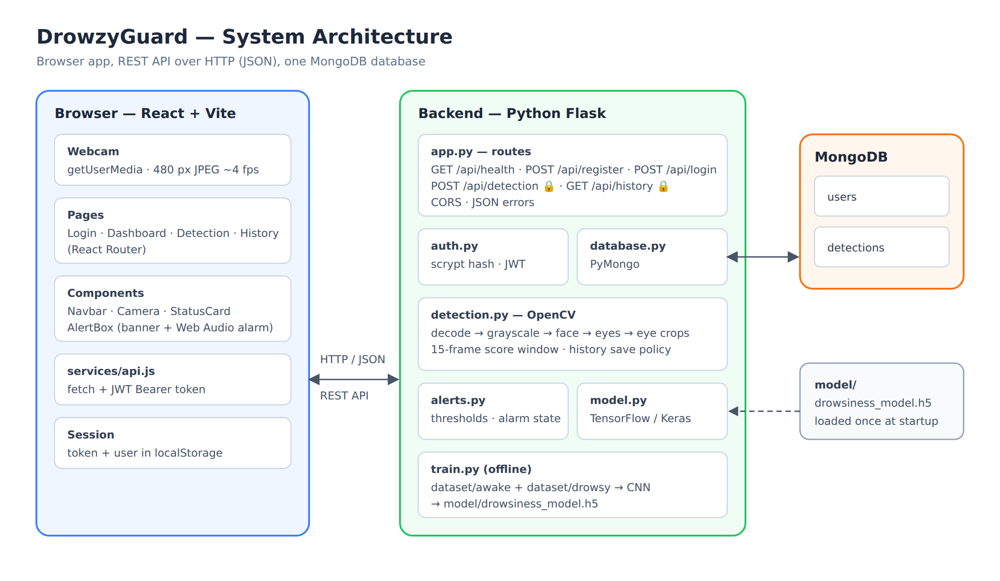
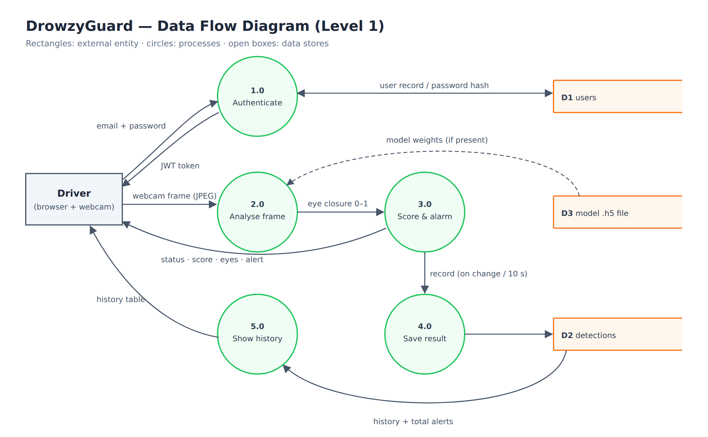
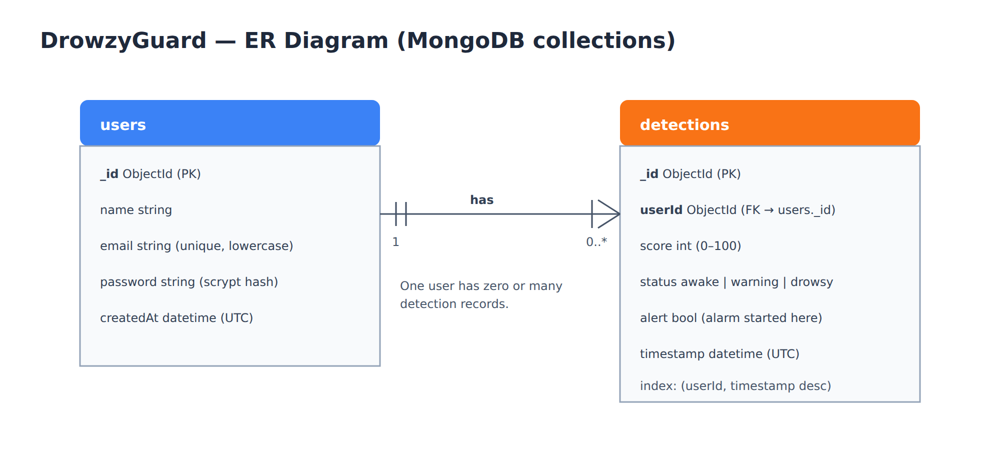
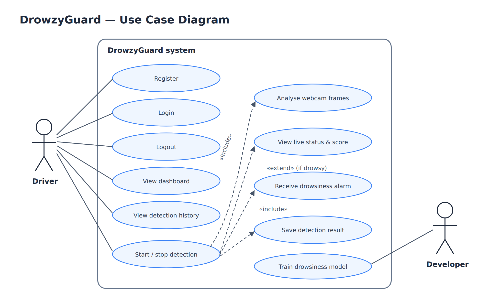

# DrowzyGuard

Real-time driver drowsiness detection in the browser. The webcam feed is analysed
frame by frame; if the driver's eyes stay closed, DrowzyGuard shows a visual
alert, sounds an alarm, and records the event in their detection history.

**Stack:** React + Vite (frontend) · Flask + OpenCV + TensorFlow/Keras (backend) · MongoDB (PyMongo)

> DrowzyGuard is a learning/demo project, not a certified safety device. Its
> thresholds are application settings, not medically validated values.



---

## Features

- **Accounts** — register, login and logout. Passwords are hashed (scrypt); sessions use JWT tokens.
- **Live detection** — webcam → face detection → eye detection → drowsiness score (0–100%).
- **Status** — Awake (0–30%), Warning (31–60%), Drowsy (61–100%), or No face.
- **Alerts** — flashing "⚠️ DROWSINESS DETECTED" banner plus an alarm tone generated in the browser.
- **History** — results are stored in MongoDB and shown on the Dashboard and History pages.
- **Trained model** — a small Keras CNN trained on the MRL Eye Dataset (98.6% on its test split, see [Model results](#model-results)). Without the model file an OpenCV fallback is used.

## Project structure

```text
DrowzyGuard/
├── backend/
│   ├── app.py            Flask app: configuration and all API routes
│   ├── detection.py      Frame decoding, face/eye detection, preprocessing, scoring
│   ├── model.py          Loads the Keras model once; predict()
│   ├── alerts.py         Status thresholds and alarm state (edit thresholds here)
│   ├── auth.py           Register, login, password hashing, JWT
│   ├── database.py       MongoDB connection, users and detections
│   ├── train.py          Trains model/drowsiness_model.h5 from dataset/
│   ├── requirements.txt
│   └── .env.example      Copy to .env
├── frontend/
│   ├── src/
│   │   ├── components/   Navbar, Camera, StatusCard, AlertBox
│   │   ├── pages/        Login, Dashboard, Detection, History
│   │   ├── services/     api.js — the only file that talks to the backend
│   │   ├── App.jsx       Routing and session
│   │   ├── config.js     Backend URL and frame interval
│   │   ├── index.css     Theme and layout
│   │   └── main.jsx
│   ├── index.html
│   ├── package.json
│   ├── vite.config.js
│   └── .env.example
├── model/                drowsiness_model.h5 (trained Keras model)
├── dataset/              awake/ and drowsy/ training images (not included)
├── docs/                 Architecture, use-case, data-flow and ER diagrams
└── README.md
```

---

## Setup

### Requirements

| Tool | Version | Check with |
|---|---|---|
| Python | **3.10 – 3.12** (TensorFlow does not support newer versions yet) | `python --version` |
| Node.js | **20.19+** or 22.12+ | `node --version` |
| MongoDB | Community Server running locally, or a free MongoDB Atlas cluster | — |
| Webcam + a modern browser | Chrome, Edge or Firefox | — |

> **Windows tip:** keep the project in a short path outside OneDrive, e.g.
> `C:\projects\drowsy-detection`. See [Troubleshooting](#troubleshooting).

### 1. Backend

**Windows (PowerShell)**
```powershell
cd DrowzyGuard\backend
python -m venv venv
venv\Scripts\activate
pip install -r requirements.txt
copy .env.example .env
```

**macOS / Linux**
```bash
cd DrowzyGuard/backend
python3 -m venv venv
source venv/bin/activate
pip install -r requirements.txt
cp .env.example .env
```

Then open `backend/.env` and set a real JWT secret. Generate one with:
```bash
python -c "import secrets; print(secrets.token_hex(32))"
```

### 2. Frontend

```bash
cd DrowzyGuard/frontend
npm install
```

### 3. Run

Use two terminals.

| Terminal | Commands | URL |
|---|---|---|
| Backend | activate the venv, then `python app.py` | http://localhost:5000/api/health |
| Frontend | `npm run dev` | http://localhost:5173 |

Open http://localhost:5173, register an account, go to **Detection** and press
**Start**. Allow camera access. Close your eyes for about 3 seconds to trigger the alarm.

`/api/health` should show `"database": "connected"` and `"model": "loaded"`.
If it shows `"model": "not found"`, the app still works using the OpenCV fallback;
see [Training a model](#training-a-model).

---

## How detection works



1. The browser captures a 480 px JPEG from the webcam about 4 times per second
   and sends it to `POST /api/detection`. The next frame is sent only after the
   previous response arrives.
2. OpenCV converts the frame to grayscale and finds the largest face and the
   eyes inside it (Haar cascades).
3. **Eye closure for this frame:**
   - **With a model:** each eye is cropped, resized to the model's input size and
     scored by the Keras model (probability the eye is closed). If the detector
     misses the eyes (common when they are closed), eye regions are estimated
     from the face's proportions.
   - **Without a model (OpenCV fallback):** the Haar eye detector mostly finds
     *open* eyes, so a visible face with no detected eyes counts as closed.
4. **Score** = average eye closure over the last 15 frames (about 3–5 seconds).
   A normal blink moves it only about 7%; closed eyes raise it steadily.
5. **Status** comes from the thresholds in `backend/alerts.py`.
6. **Alarm:** starts when the status becomes Drowsy and keeps sounding until
   the score falls to 40% or below (`ALARM_OFF_SCORE`), so it does not flicker
   around the threshold. It also keeps sounding if the face disappears while
   drowsy (for example, if the head drops). The tone is generated in the browser
   with the Web Audio API; pressing **Start** unlocks browser audio.
7. **History:** a record is saved on every status or alarm change and at most
   every 10 seconds otherwise. `alert` is `true` only on the record where an
   alarm started, so **Total Alerts** counts alarm events.

### Tuning

| Setting | File | Default |
|---|---|---|
| `AWAKE_MAX`, `WARNING_MAX` (status thresholds) | `backend/alerts.py` | 30, 60 |
| `ALARM_OFF_SCORE` (alarm stops at or below) | `backend/alerts.py` | 40 |
| `WINDOW_SIZE` (frames averaged into the score) | `backend/detection.py` | 15 |
| `SAVE_INTERVAL_SECONDS` (history save rate) | `backend/detection.py` | 10 |
| `FRAME_INTERVAL_MS` (pause between frames) | `frontend/src/config.js` | 250 |
| Alarm tones, volume and rhythm | `frontend/src/components/AlertBox.jsx` | 880/660 Hz, every 500 ms |

---

## Model results

`model/drowsiness_model.h5` was trained with `train.py` (10 epochs, 64×64
grayscale, CPU) on the **MRL Eye Dataset** (Kaggle version
`akashshingha850/mrl-eye-dataset`, v4), with the dataset's `sleepy` class used as `drowsy`.

| Evaluation | Images | Accuracy |
|---|---|---|
| Held-out 20% of the `train` split (`train.py`) | 10,187 | 98.40% |
| The dataset's separate `test` split | 16,981 | 98.57% |

These numbers describe eye-crop classification on MRL images. MRL images are
infrared close-ups; live webcam performance depends on lighting and camera and
has not been measured, and the drowsiness score and alarm thresholds on top of
the model are application settings, not validated values.

## Training a model

1. Get **eye crop** images (one eye per image). The MRL Eye Dataset works well
   (check its license):
   ```bash
   pip install kagglehub
   python -c "import kagglehub; print(kagglehub.dataset_download('akashshingha850/mrl-eye-dataset'))"
   ```
   Its `data/train/awake` folder holds open eyes and `data/train/sleepy` closed eyes.
   Rename `sleepy` to `drowsy` (or copy the images into `dataset/awake/` and `dataset/drowsy/`).
2. From `backend/` with the venv active:
   ```bash
   python train.py                                  # uses ../dataset
   python train.py --dataset <path>/data/train      # or point it at the downloaded folder
   # options: --epochs 15 --img-size 64 --batch-size 32
   ```
3. It trains a small CNN, prints **accuracy on a held-out 20% of your images**,
   and saves `model/drowsiness_model.h5`.
4. Restart the backend. `/api/health` shows `"model": "loaded"`, and the
   Detection page badge changes from "OpenCV fallback" to "AI model".

`model.py` reads the input size from the model file, so any image size works.
Models with one sigmoid output (P(drowsy)) or two softmax outputs
([awake, drowsy]) are supported.

---

## API

Every response is JSON. Errors always look like `{"error": "message"}`.
Routes marked 🔒 need the header `Authorization: Bearer <token>`.

| Method & path | Body / query | Success response |
|---|---|---|
| `GET /api/health` | — | `{"status": "ok", "database": "connected", "model": "not found", "detection": "opencv fallback"}` |
| `POST /api/register` | `{"email", "password"}` (6–128 chars) | `201 {"token", "user": {"id", "name", "email"}}` |
| `POST /api/login` | `{"email", "password"}` | `{"token", "user": {...}}` |
| `POST /api/detection` 🔒 | `{"image": "<base64 JPEG or data URL>", "reset": false}` | `{"status": "drowsy", "score": 82, "eyes": "closed", "face": true, "box": {"x": 0.31, "y": 0.22, "w": 0.26, "h": 0.35}, "alert": true}` |
| `GET /api/history` 🔒 | `?limit=100` (1–500) | `{"history": [{"id", "score", "status", "alert", "timestamp"}], "totalAlerts": 5}` |

`status` is one of `awake`, `warning`, `drowsy`, `no_face`. `box` is the detected
face as fractions of the frame (the green box on the live camera), or `null` when no face is found. Send `"reset": true`
with the first frame of a session to start a fresh score.

| Code | Meaning |
|---|---|
| 400 | Invalid input (bad email, short password, missing or invalid image) |
| 401 | Not logged in, wrong credentials, or expired/invalid token |
| 409 | Email already registered |
| 413 | Image larger than 2 MB |
| 503 | MongoDB unavailable |

## Database



Two collections in the database named by `MONGO_DB`:

| `users` | `detections` |
|---|---|
| `_id`, `name`, `email` (unique, lowercase), `password` (hash), `createdAt` | `_id`, `userId` → users, `score`, `status`, `alert`, `timestamp` |

Indexes are created automatically at startup.

## Configuration

**`backend/.env`**

| Variable | Purpose | Default |
|---|---|---|
| `MONGO_URI` | MongoDB connection string (local or Atlas) | `mongodb://localhost:27017` |
| `MONGO_DB` | Database name | `drowzyguard` |
| `JWT_SECRET` | Secret for signing login tokens. **Required**; use a long random value | — |
| `FRONTEND_ORIGIN` | Allowed browser origins (comma-separated) | `http://localhost:5173,http://127.0.0.1:5173` |
| `MODEL_PATH` | Keras model file | `../model/drowsiness_model.h5` |
| `PORT` | Backend port | `5000` |
| `FLASK_DEBUG` | `1` = auto-reload during development | `1` |

**`frontend/.env`** (optional): `VITE_API_URL`, the backend URL (default `http://localhost:5000`).

Never commit `.env` files; `.gitignore` already excludes them.

## Use cases



---

## Troubleshooting

| Problem | Fix |
|---|---|
| `pip install` fails on Windows with *"No such file or directory … Long Path support"* | Enable long paths (admin PowerShell): `New-ItemProperty -Path "HKLM:\SYSTEM\CurrentControlSet\Control\FileSystem" -Name "LongPathsEnabled" -Value 1 -PropertyType DWORD -Force`, restart, delete `venv` and reinstall. Or move the project to a short path like `C:\projects`. |
| Installs are slow or files get locked | The project is inside OneDrive, which syncs `venv` and `node_modules`. Move it outside OneDrive. |
| TensorFlow will not install | Use Python 3.10–3.12. |
| `/api/health` shows `"database": "disconnected"` | Start MongoDB, or put your Atlas connection string in `MONGO_URI`. |
| Backend exits with *"JWT_SECRET is not set"* | Create `backend/.env` from `.env.example` and set `JWT_SECRET`. |
| *"Cannot reach the server"* in the app | Start the backend (`python app.py`) and check `VITE_API_URL`. |
| Camera error in the browser | Allow camera access for the site, close other apps using the camera, and use `http://localhost` (browsers block cameras on plain-http non-localhost addresses). |
| No alarm sound | Check the tab isn't muted and the system volume is up. Sound is only allowed after you click **Start** or **Start Detection**. |
| Eyes reported "closed" while open (fallback mode) | Improve lighting and face the camera. Glasses and turned heads confuse the Haar eye detector; a trained model does better. |
| `AttributeError: module 'cv2' has no attribute 'CascadeClassifier'` | OpenCV 5 removed Haar cascades. Reinstall the pinned version: `pip install -r requirements.txt` (OpenCV 4.14). |
